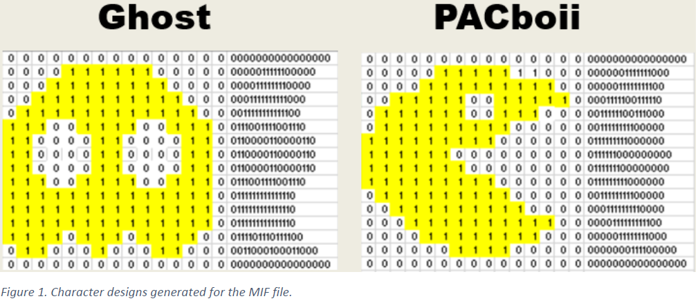
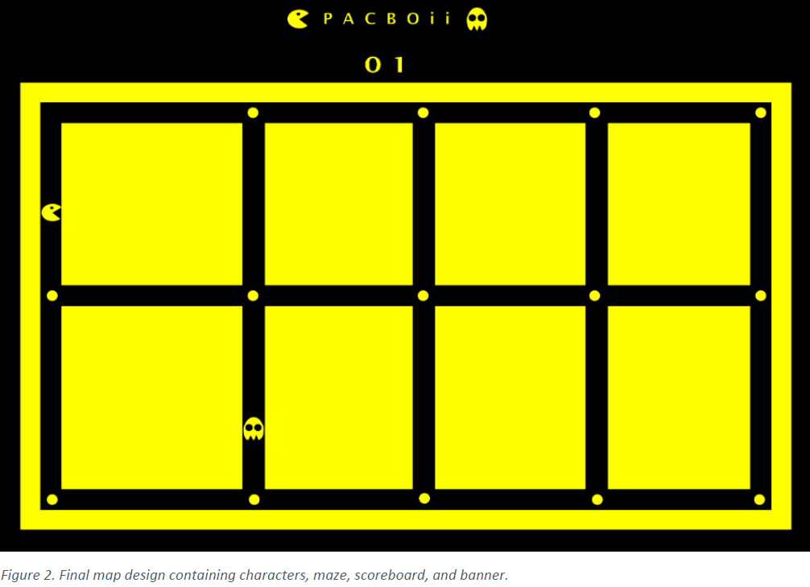

## Pac-Man in VHDL

1. Pac-Man in VHDL Project Description:
~~~~
This is an implementation of a version of the game ‘PAC-MAN’ (We called it PacBoi) using an FPGA with some creative twists to it. The project
allowed a user to interface with the Altera DE2 board to interact with the game and select either one of
the displaying game figures as the character of choice. To accomplish this task successfully, multiple
modules were created as and designed as a block diagram in Quartus II using VHDL syntax.
~~~~

2. File Contents:
~~~~
Six design blocks including: clkdiv for
diving the Altera DE2 board clock from 50 MHz to 25 MHz; vgasync for synchronizing the board output
with the VGA screen; yakuza_conv for interpreting required colors to the VGA screen; clock div for
dividing the board clock into categories between 1 Hz to 5 KHz; char_rom for reading the memory
initialization file (MIF) file containing all characters to be used in the game design (see Fig. 1 for examples); and msghello for
handling all of the game’s physical design and logic implementation.
~~~~

### MIF - Example

## GUI Overview
### Final Map Design

 

### Final Game Design Notes
~~~~
The final design leaves a great deal for optimization, such as de-bouncer implementing to allow
for smoother button interaction with the user. Furthermore, improvements to the game itself could be
made such as increased difficulties, increased player numbers, and improving the color scheme. The
game could potentially be designed for faster gameplay rates that separate the difficulty levels of
several stages. More characters could be added to the design to allow more player interaction. Visually,
the game could be made more appealing by adding unique colors to each defined block or set of blocks
within the game character design. This would make the game more interactive and enjoyable among the
users.
~~~~
